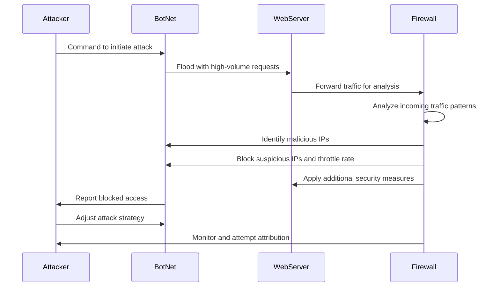

# **DDoS Attack Sequence of Events**
1. The Attacker initiates the attack on the WebServer by issuing a command to the BotNet.
2. The BotNet then floods the WebServer with a high volume if requests.
3. The WebServer recognizes a high vlume of requests being sent and forwards the traffic to the Firewall for analysis
   * The Firewall identifies malicious IPs
   * Blocks suspicious IPs
   * Throttles traffic to help ensure legitimate users are not impacted
   * Applies any additional security measures to the WebServer
4. The BotNet recognizes and reports blocked access back to the Attacker, who then attempts to adjust the attack strategy.
5. The Firewall continues to monitor traffic for suspicious patterns and attempts to identify their sources
